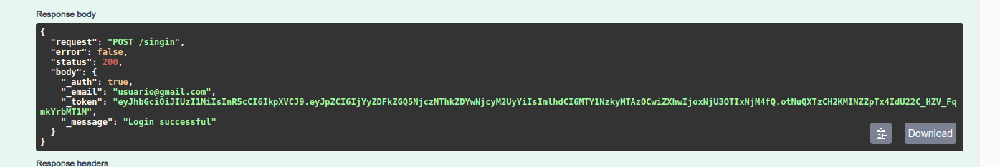
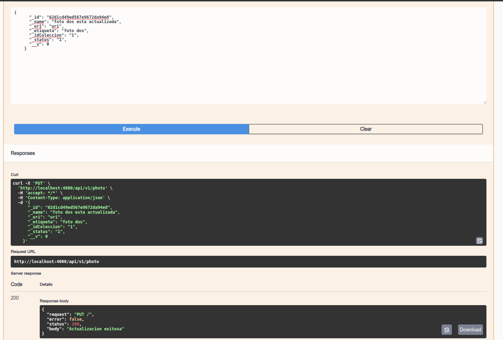

## Proyecto Unsplash-image

### Diagrama de las clases

### Codigo Fuente

### Documentacion api

### Capturas de pantalla

- Puedo registrarme con un correo electronico en la plataforma.

- Para ingresar a la platforma debo ingresar mi correo y contrasena

- Puedo agregar una nueva foto a mi coleccion de imagenes

- Puedo ver una lista de mis fotografias.

- Historia de usuario: Puedo buscar fotos por etiqueta.

- Puedo actualizar una fotografia.

- Puedo eliminar una fotografia.

- Todas mis operaciones debe estar protegidas(utilizar jwt).

- Mi contrasena es segura(Tiene mayuscula, numero, longitu mayor a 8 caracteres, y un caracter especial

